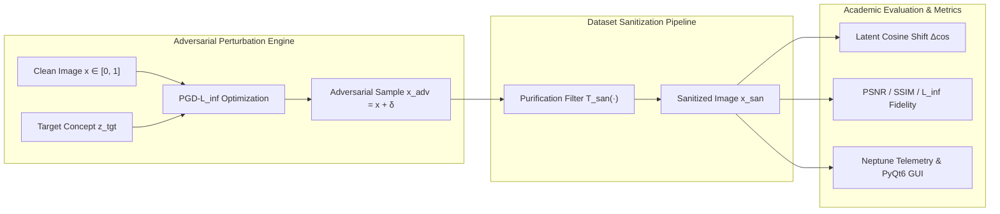

# Project-ShadeProof

Project-ShadeProof provides a PyQt desktop interface for running surrogate-model adversarial evaluation loops and logging experiment metrics to Neptune.

## Zenodo DOI setup

This repository includes Zenodo metadata in `.zenodo.json` so releases can be archived with a DOI.

DOI: Zenodo
https://doi.org/10.5281/zenodo.22811993
https://doi.org/10.5281/zenodo.22811994

= "The University of Chicago won't take my calls any more.
...
The reason I built Project ShadeProof- : I saw it as 'inevitable' that someone would try to (not only) reverse engineer their attack vector;
 ((random jpeg poisoning-: of the training data))
 But someone would attempt to build a model that can 'protect' itself from poisoning attacks.
 A model with self-correcting behavior, a model that understands artistic expression at every level,
 and in a way- I just wanted to be first. I think that was it. : when I started it in 2023: I
 wanted a project that was so large in scope that it would utterly slow me down.
 It didn't.
 I just made an awkward 'dent' on the historical timeline; some strange thing- that the University of Chicago would have to
 either acknowledge or ignore entirely- and later, only much later- did I consider it as an avenue to Science Grant Funding.
 Even then-; to articulate the 'philosophical theoretical concept' of the project is enough, I think-
 to contribute; to the scientific discussion. My prayer; is that it is not- overly used-: that art is still remained a sacred thing.
 The simplicity of it was thusly explained-
 AI art already has it's place- in society. This was simply one of the many attempts by a human being: to metabolize that fact.
 To come to peace with it. We will rage: against ALL things new. We will find fault in every major fad.
 This is simply a deeper examination of the academic urges behind it. : there will of course- be someone who does not shy;
 does not falter from any training data. There will be those who want to build a model: and seek to 'absorb everything'.

 I did not build this for them.
 I built this for me. : to see what I can do.          -David Burmeister "

 ##
Project start-: September 2023: last correspondence with the U: March 1st.
 Projects sited-; Original.
-- https://www.nightshadesoftware.org/projects/nightshade/files?sort=size%3Adesc%2Cfilename%2Cdownloads
-- https://discuss.pytorch.org/t/pytorch-pickled-tensors/76098
-- https://nightshade.cs.uchicago.edu/whatis.html
-- https://huggingface.co/docs/hub/en/security-pickle

somewhat similar-; good paper of reference.
https://openreview.net/pdf?id=p4xLHcTLRwh

https://community.neptune-software.com/topics/neptune-dxp/blogs/neptune--d-x-p----architecture--diagrams

SAND Labs-: multiple citations similar : 'On the Feasibility of Poisoning Text-to-Image AI Models via Adversarial Mislabeling
Stanley Wu, Ronik Bhaskar, Anna Yoo-Jeong Ha, Shawn Shan, Haitao Zheng, Ben Y. Zhao -Taiwan; October, 2025'

Etc. ^
... 
-- https://sandlab.cs.uchicago.edu/pubs.html
 *discrepancy: found 'Project NightShade';of Vault 7 fame- no sited reverences to this project-: will call it -"v7.NightShade" for sake of this project.-  -- https://wikileaks.org/vault7/document/NightshadeUsersManual/page-3/#pagination

---
language:
- en
license: apache-2.0
tags:
- adversarial-robustness
- data-poisoning
- dataset-sanitization
- diffusion-models
- vision-language
- clip
- pytorch
pipeline_tag: image-feature-extraction
inference: false
---
# Project-ShadeProof
### Empirical Evaluation of Surrogate Adversarial Perturbations and Dataset Sanitization Against Generative Data Poisoning

---
## Abstract
Data poisoning attacks targeting text-to-image diffusion models—most prominently demonstrated by prompt-specific surrogate perturbation systems such as *Nightshade* and style-cloaking frameworks like *Glaze*—exploit visual-language feature representations (e.g., CLIP, OpenCLIP) to induce concept confusion during downstream training. By subtly manipulating pixel matrices under imperceptible $\ell_\infty$ bounds, an attacker can coerce a model into associating source concepts (e.g., *a dog*) with disjoint target semantic attractors (e.g., *a leather handbag*).
**Project-ShadeProof** establishes a reproducible, open-source scientific framework to evaluate surrogate-model adversarial vulnerability and benchmark data sanitization defenses. ShadeProof implements:
1. **Mathematical Surrogate Attack Optimization**: Constrained Projected Gradient Descent ($\text{PGD}\text{-}\ell_\infty$) and Fast Gradient Sign Method ($\text{FGSM}$) in vision-language latent space.
2. **Defensive Dataset Sanitization Suite**: Evaluation of spatial, frequency-domain (JPEG lossy DCT quantization), total variation denoising, and latent representation anomaly detection.
3. **Dual Telemetry & Scientific Interface**: A rich PyQt6 research GUI alongside headless automated benchmark runners compatible with Neptune.ai cloud logging.
---
## Threat Model & Mathematical Formulation

### 1. Attacker Optimization (Surrogate Concept Alignment)
Let $x \in [0, 1]^{C \times H \times W}$ denote the clean input image and $y_{\text{tgt}}$ denote the targeted concept prompt. A surrogate vision-language encoder (e.g., CLIP ViT-B/32) maps visual inputs to normalized embeddings $f_{\text{img}}(x) \in \mathbb{S}^{d-1}$ and text prompts to $f_{\text{text}}(y_{\text{tgt}}) \in \mathbb{S}^{d-1}$.
The attacker solves the constrained optimization problem:
$$\min_{\delta} \; \mathcal{L}_{\text{adv}}(x + \delta) \quad \text{s.t.} \quad \|\delta\|_\infty \le \epsilon, \quad (x + \delta) \in [0, 1]^{C \times H \times W}$$
where the objective maximizes cosine similarity to the target concept:
$$\mathcal{L}_{\text{adv}}(x') = - \cos\left(f_{\text{img}}(x'), f_{\text{text}}(y_{\text{tgt}})\right) = - \frac{f_{\text{img}}(x') \cdot f_{\text{text}}(y_{\text{tgt}})}{\|f_{\text{img}}(x')\|_2 \|f_{\text{text}}(y_{\text{tgt}})\|_2}$$
At iteration $t$, the Projected Gradient Descent update rule is:
$$x'_{t+1} = \Pi_{x + \mathcal{S}_\epsilon} \left( x'_t - \alpha \cdot \text{sign}\left(\nabla_{x'_t} \mathcal{L}_{\text{adv}}(x'_t)\right) \right)$$
where $\mathcal{S}_\epsilon = \{ \delta \mid \|\delta\|_\infty \le \epsilon \}$ and $\Pi$ denotes pixel-domain clipping to $[0, 1]$.
### 2. Defender Formulation (Self-Correction & Sanitization)
To prevent dataset pollution, a curator or downstream training pipeline applies a sanitization operator $\mathcal{T}_{\text{san}}: [0, 1]^{C \times H \times W} \to [0, 1]^{C \times H \times W}$.
 

 
