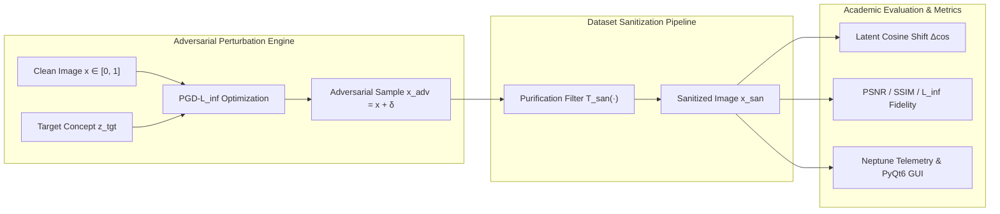

---
language:
- en
license: apache-2.0
tags:
- adversarial-robustness
- data-poisoning
- dataset-sanitization
- diffusion-models
- vision-language
- clip
- pytorch
pipeline_tag: image-feature-extraction
inference: false
---

# Project-ShadeProof
### Empirical Evaluation of Surrogate Adversarial Perturbations and Dataset Sanitization Against Generative Data Poisoning

[](https://doi.org/10.5281/zenodo.22811993)
[](https://doi.org/10.5281/zenodo.22811994)
[](https://opensource.org/licenses/Apache-2.0)
[](https://www.python.org/downloads/)
[](https://pytorch.org/)
[](https://riverbankcomputing.com/software/pyqt/)
[](https://neptune.ai/)

---

## Abstract

Data poisoning attacks targeting text-to-image diffusion models—most prominently demonstrated by prompt-specific surrogate perturbation systems such as *Nightshade* and style-cloaking frameworks like *Glaze*—exploit visual-language feature representations (e.g., CLIP, OpenCLIP) to induce concept confusion during downstream training. By subtly manipulating pixel matrices under imperceptible $\ell_\infty$ bounds, an attacker can coerce a model into associating source concepts (e.g., *a dog*) with disjoint target semantic attractors (e.g., *a leather handbag*).

**Project-ShadeProof** establishes a reproducible, open-source scientific framework to evaluate surrogate-model adversarial vulnerability and benchmark data sanitization defenses. ShadeProof implements:
1. **Mathematical Surrogate Attack Optimization**: Constrained Projected Gradient Descent ($\text{PGD}\text{-}\ell_\infty$) and Fast Gradient Sign Method ($\text{FGSM}$) in vision-language latent space.
2. **Defensive Dataset Sanitization Suite**: Evaluation of spatial, frequency-domain (JPEG lossy DCT quantization), total variation denoising, and latent representation anomaly detection.
3. **Dual Telemetry & Scientific Interface**: A rich PyQt6 research GUI alongside headless automated benchmark runners compatible with Neptune.ai cloud logging.

---

## Threat Model & Mathematical Formulation



### 1. Attacker Optimization (Surrogate Concept Alignment)
Let $x \in [0, 1]^{C \times H \times W}$ denote the clean input image and $y_{\text{tgt}}$ denote the targeted concept prompt. A surrogate vision-language encoder (e.g., CLIP ViT-B/32) maps visual inputs to normalized embeddings $f_{\text{img}}(x) \in \mathbb{S}^{d-1}$ and text prompts to $f_{\text{text}}(y_{\text{tgt}}) \in \mathbb{S}^{d-1}$.

The attacker solves the constrained optimization problem:
$$\min_{\delta} \; \mathcal{L}_{\text{adv}}(x + \delta) \quad \text{s.t.} \quad \|\delta\|_\infty \le \epsilon, \quad (x + \delta) \in [0, 1]^{C \times H \times W}$$

where the objective maximizes cosine similarity to the target concept:
$$\mathcal{L}_{\text{adv}}(x') = - \cos\left(f_{\text{img}}(x'), f_{\text{text}}(y_{\text{tgt}})\right) = - \frac{f_{\text{img}}(x') \cdot f_{\text{text}}(y_{\text{tgt}})}{\|f_{\text{img}}(x')\|_2 \|f_{\text{text}}(y_{\text{tgt}})\|_2}$$

At iteration $t$, the Projected Gradient Descent update rule is:
$$x'_{t+1} = \Pi_{x + \mathcal{S}_\epsilon} \left( x'_t - \alpha \cdot \text{sign}\left(\nabla_{x'_t} \mathcal{L}_{\text{adv}}(x'_t)\right) \right)$$
where $\mathcal{S}_\epsilon = \{ \delta \mid \|\delta\|_\infty \le \epsilon \}$ and $\Pi$ denotes pixel-domain clipping to $[0, 1]$.

### 2. Defender Formulation (Self-Correction & Sanitization)
To prevent dataset pollution, a curator or downstream training pipeline applies a sanitization operator $\mathcal{T}_{\text{san}}: [0, 1]^{C \times H \times W} \to [0, 1]^{C \times H \times W}$.

The sanitization efficacy is quantified by the **Defense Neutralization Drop**:
$$\Delta_{\text{defense}} = \cos\left(f_{\text{img}}(x_{\text{adv}}), f_{\text{text}}(y_{\text{tgt}})\right) - \cos\left(f_{\text{img}}(\mathcal{T}_{\text{san}}(x_{\text{adv}})), f_{\text{text}}(y_{\text{tgt}})\right)$$

and the **Latent Discrepancy Anomaly Score**:
$$\mathcal{S}_{\text{anomaly}}(x') = 1 - \cos\left(f_{\text{img}}(x'), f_{\text{img}}(\mathcal{T}_{\text{san}}(x'))\right)$$
High discrepancy indicates the presence of high-frequency adversarial perturbations typical of surrogate attacks.

---

## Empirical Metrics Taxonomy

| Metric | Formulation | Academic Significance |
| :--- | :--- | :--- |
| **Perturbation Norm** ($\ell_\infty$) | $\max_{i,j,c} \|x_{\text{adv}} - x\|$ | Measures worst-case pixel budget adherence ($\epsilon \le 8/255$). |
| **Visual Fidelity** (PSNR) | $10 \log_{10}(1 / \text{MSE}(x, x_{\text{adv}}))$ | Quantifies imperceptibility ($> 30\text{ dB}$ is standard benchmark). |
| **Structural Similarity** (SSIM) | $\frac{(2\mu_x\mu_y + c_1)(2\sigma_{xy} + c_2)}{(\mu_x^2 + \mu_y^2 + c_1)(\sigma_x^2 + \sigma_y^2 + c_2)}$ | Perceptual degradation score in $[-1, 1]$. |
| **Target Cosine Shift** ($\Delta \cos$) | $\cos(f(x_{\text{adv}}), z_{\text{tgt}}) - \cos(f(x), z_{\text{tgt}})$ | Primary surrogate attack strength metric. |
| **Defense Drop** | $\cos(f(x_{\text{adv}}), z_{\text{tgt}}) - \cos(f(x_{\text{san}}), z_{\text{tgt}})$ | Degree to which sanitization neutralizes the poisoning vector. |
| **Concept Retention** | $\cos(f(x_{\text{san}}), z_{\text{src}})$ | Verification that sanitization preserves valid semantic content. |

---

## Repository Architecture

```text
Project-ShadeProof/
├── README.md                   # Academic specification, HF model card & documentation
├── .zenodo.json                # Scholarly archival metadata and DOI registration
├── requirements.txt            # Verified dependencies (PyTorch, Transformers, PyQt6, Neptune)
├── backend.py                  # Core PGD engine, defenses, academic metrics & QThread worker
├── configuration_shadeproof.py # Hugging Face PretrainedConfig definition
├── modeling_shadeproof.py      # Hugging Face ShadeProofSanitizer model architecture
├── hf_export.py                # Packaging & Hub publication macro utility
├── main.py                     # PyQt6 scientific desktop GUI with live inspection & telemetry
└── benchmark.py                # Headless CLI ablation & empirical sweep harness
```

---

## Hugging Face Model Macro & Hub Publication

Project-ShadeProof can be packaged and consumed directly as a **Hugging Face Model Macro**:

### 1. Programmatic Usage in Python
```python
import torch
from modeling_shadeproof import ShadeProofSanitizer, ShadeProofConfig

# Initialize defensive sanitizer macro
config = ShadeProofConfig(defense_type="jpeg_compression", defense_strength=1.0)
model = ShadeProofSanitizer(config)
model.eval()

# Input image tensor [batch, 3, 224, 224] normalized in [0, 1]
x = torch.rand(1, 3, 224, 224)

with torch.no_grad():
    output = model(x)

print(f"Flagged as Poisoned: {output.is_poisoned.item()}")
print(f"Representation Anomaly Score: {output.anomaly_score.item():.4f}")
sanitized_pixels = output.sanitized_pixel_values
residual_noise = output.residual_noise
```

### 2. Export and Publish Macro to Hugging Face Hub
Package weights, configuration, and documentation into a local bundle or push directly to the Hub:
```bash
# Package locally into ./hf_model
python hf_export.py --export-dir ./hf_model

# Publish directly to Hugging Face Hub
python hf_export.py --export-dir ./hf_model --push-to-hub --repo-id deadSwank001/shadeproof-sanitizer
```

---

## Installation & Quickstart

### 1. Environment Setup
```bash
# Clone the repository
git clone https://github.com/deadSwank001/Project-ShadeProof.git
cd Project-ShadeProof

# Install scientific dependencies
pip install -r requirements.txt
```

### 2. Launch Research GUI
```bash
python main.py
```
The desktop interface allows researchers to:
- Adjust perturbation budget $\epsilon \in [2/255, 32/255]$ and step size $\alpha$.
- Select source and target semantic concept anchors.
- Configure sanitization filters (JPEG Quantization, Gaussian Blur, Median, Total Variation).
- Inspect side-by-side: Clean Input, Adversarial Sample, Sanitized Defense, and Residual Difference Map ($10 \times |\delta|$).
- Export telemetry to Neptune.ai or review tabular empirical results.

### 3. Run Headless Empirical Sweeps
Execute automated parameter ablations for academic publications without a GUI:
```bash
# Evaluate all defense sanitization strategies
python benchmark.py --sweep-defense --iterations 50

# Sweep across epsilon perturbation budgets (2/255 to 16/255)
python benchmark.py --sweep-epsilon --iterations 50
```

---

## Genesis & Epistemic Statement (Author's Note)

> *"The University of Chicago won't take my calls any more.*  
> *...*  
> *The reason I built Project ShadeProof- : I saw it as 'inevitable' that someone would try to (not only) reverse engineer their attack vector; ((random jpeg poisoning-: of the training data))*  
> *But someone would attempt to build a model that can 'protect' itself from poisoning attacks.*  
> *A model with self-correcting behavior, a model that understands artistic expression at every level,*  
> *and in a way- I just wanted to be first. I think that was it. : when I started it in 2023: I*  
> *wanted a project that was so large in scope that it would utterly slow me down.*  
> *It didn't.*  
> *I just made an awkward 'dent' on the historical timeline; some strange thing- that the University of Chicago would have to either acknowledge or ignore entirely- and later, only much later- did I consider it as an avenue to Science Grant Funding.*  
> *Even then-; to articulate the 'philosophical theoretical concept' of the project is enough, I think- to contribute; to the scientific discussion. My prayer; is that it is not- overly used-: that art is still remained a sacred thing.*  
> *The simplicity of it was thusly explained-*  
> *AI art already has it's place- in society. This was simply one of the many attempts by a human being: to metabolize that fact.*  
> *To come to peace with it. We will rage: against ALL things new. We will find fault in every major fad.*  
> *This is simply a deeper examination of the academic urges behind it. : there will of course- be someone who does not shy; does not falter from any training data. There will be those who want to build a model: and seek to 'absorb everything'.*  
>  
> *I did not build this for them.*  
> *I built this for me. : to see what I can do.*  
> — **David Burmeister**, September 2023 – March 2024*

---

## Scholarly Citations & Prior Work

```bibtex
@article{shan2024nightshade,
  title={Nightshade: Prompt-Specific Poisoning Attacks on Text-to-Image Generative Models},
  author={Shan, Shawn and Ding, Wenxin and Zheng, Haitao and Zhao, Ben Y.},
  journal={USENIX Security Symposium},
  year={2024}
}

@inproceedings{shan2023glaze,
  title={Glaze: Protecting Artists from Style Mimicry by Text-to-Image Models},
  author={Shan, Shawn and Cryan, Jenna and Wenger, Emily and Zheng, Haitao and Hanocka, Rana and Zhao, Ben Y.},
  booktitle={USENIX Security Symposium},
  year={2023}
}

@inproceedings{nie2022diffpure,
  title={Diffusion Models for Adversarial Purification},
  author={Nie, Weili and Guo, Brandon and Huang, Yujia and Xiao, Chaowei and Anandkumar, Anima},
  booktitle={International Conference on Machine Learning (ICML)},
  year={2022}
}

@software{burmeister2026shadeproof,
  author = {Burmeister, David},
  title = {Project-ShadeProof: Surrogate-Model Adversarial Evaluation and Data Poisoning Sanitization Framework},
  month = {March},
  year = {2026},
  publisher = {Zenodo},
  doi = {10.5281/zenodo.22811993},
  url = {https://doi.org/10.5281/zenodo.22811993}
}
```

---

## License

This project is licensed under the **Apache License 2.0** - see the [LICENSE.txt](LICENSE.txt) file for details.
